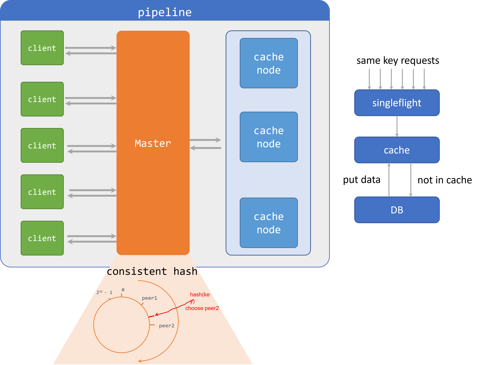

## MINI-DistributedCache

### 已实现接口
-   Cache 
    -   支持 key (字符串), value (实现了 Value 接口的对象) 的存储。
    -   缓存替换策略采用并发安全的 LRU/LRU-k 算法，默认替换策略是 LRU-k。

-   Service 
    -   对 Cache 提供了一层封装，允许在实例化时传入 `Getter` 接口，当缓存未命中时，通过该接口从本地数据库中获取数据。
    -   单机支持多个服务，每个实例通过不同的名称 (name) 进行区分，彼此不共享缓存。
    -   使用包级别的并发安全变量(`groups`)记录名称到服务的映射关系。
    -   `Get` 方法使用 singleflight 包避免缓存穿透时大量请导致的数据库雪崩问题。
    -   `Put` 方法目前暂时存在缓存和数据库中内容不一致的情况 

-   Server 
    -   通过实现 `http.ServeHTTP` 进行挂载，通过特定 url `http://addr:port/_Cache/service_name/key` 访问缓存数据。

-   Master 
    -   负责节点注册、删除及请求的转发等功能。
        -   注册时，实例化对应节点的客户端，用于后续请求转发
    -   利用一致性哈希，将空间划分为 0~2^32 - 1 的哈希环，所有节点映射到哈希环上
        -   为了避免请求的 key 分布不均匀的情况，每个真实节点复制生成了多个虚拟节点
        -   在地址后面加标号 [复制数为 5, peer1(正常应该是节点对应的地址 ip:port)，虚拟节点为 peer11, peer12, peer13, peer14, peer15]
    -   实例化 Master 节点时需要传入哈希函数，默认为 `crc32`
    -   收到请求后，计算请求 key 的哈希值，顺时针寻找距其最近的节点

注册节点只发生在 master 节点启动阶段，用户不感知。master 对外暴露了 `/api` 接口，用户对 `http://master_addr:port/api?name={service_name}&key={key}` 发起请求，获取 key 对应的 value。

整个流程如下图所示：

### 存在的问题

1. 需要事先确定所有缓存节点的 ip + 端口，因此进行节点添加的时候会很麻烦，需要把 master 节点停掉，再重新启动。
2. 如果缓存节点挂掉了，master 节点无法得知，因此所有映射到该节点的请求都会失败。
3. master 节点挂掉。

### 后续的解决方案

1. master 节点可以开放一个注册接口，当缓存节点启动后可自行访问该接口进行节点注册。(对于可能存在的缓存节点先于 Master 启动的情况，可通过设置标志位并定期尝试注册来解决)
2. 引入心跳检测机制，周期性地广播心跳给所有缓存节点，并设定超时时间。若规定时间内某节点未能效应，则将起视为失效并从节点中删除。
3. 部署 master 节点集群

### 参考

1. [https://github.com/golang/groupcache](https://github.com/golang/groupcache)
2. [https://github.com/geektutu/7days-golang](https://github.com/geektutu/7days-golang)